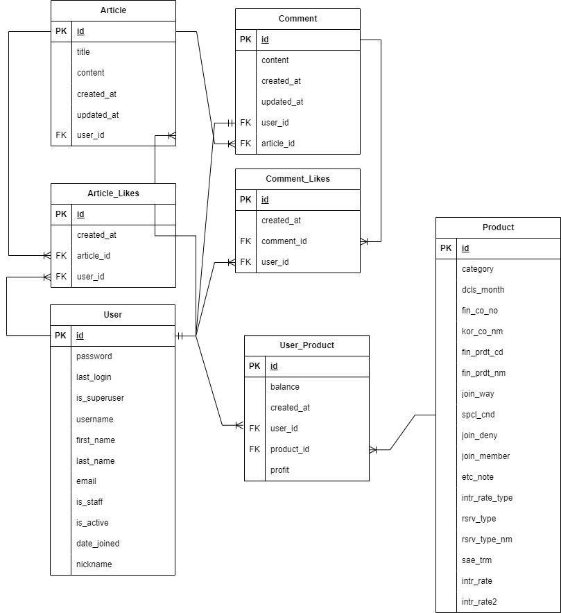

# 서비스명

## 팀원 정보 및 업무 분담 내역

최우진

- 팀장
- 로그인 기능 구현
- 금융 상품 추천 알고리즘 구현
- 근처 은행 검색 기능 구현
- 커뮤니티 기능 구현
- 회원 커스터마이징

임광영

- 상품 가입하기 기능 구현
- 예적금 금리 비교 기능 구현
- 금융 상품 추천 알고리즘 구현
- 근처 은행 검색 기능 구현

정태완

- 금융 상품 가입하기 기능 구현
- 환율 계산기 기능 구현
- 회원 커스터마이징

공통

- 프로젝트 기능 분리 및 일정 조정
- Vue 초기 설정
- Django 초기 설정
- ERD 설계
- Component, View 구조 설계 및 구현
- 오류 해결

## 설계 내용(아키텍처 등) 및 실제 구현 정도

Component 설계도 넣고...아키텍처고 나발이고를 쓴 적이 없는데 이게 무슨 개소리야

## 데이터베이스 모델링(ERD)



User Table

- Django의 AbstractUser를 상속
- nickname: 닉네임

Article Table

- id: 게시글 ID
- title: 게시글 제목
- content: 게시글 내용
- created_at
- updated_at
- user_id
  - User:Article은 1:N 관계

Article_Likes Table

- 좋아요 구현 시 User:Article의 N:M 관계를 2개의 1:N 관계로 분리하기 위한 relation table

- id: 게시글 좋아요 ID
- created_at
- article_id
  - Article:Article_Likes는 1:N 관계
- user_id
  - User:Article_Likes는 1:N 관계

Comment Table

- id: 댓글 ID
- content
  - 댓글 내용
- created_at
- updated_at
- user_id
  - User:Comment는 1:N 관계
- article_id
  - Article:Comment는 1:N 관계

Comment_Likes Table

- 좋아요 구현 시 User:Comment의 N:M 관계를 2개의 1:N 관계로 분리하기 위한 relation table

- id: 댓글 좋아요 ID
- created_at
- comment_id
  - Comment:Comment_Likes는 1:N 관계
- user_id
  - User:Comment_Likes는 1:N 관계

Product Table

- id: 금융 상품 ID
- category: 예적금 -> 0: 예금, 1: 적금
- dcls_month: 공시 제출월[YYYYMM]
- fin_co_no: 금융회사 코드
- kor_co_nm: 금융회사 명
- fin_prdt_cd: 금융회사 코드
- fin_prdt_nm: 금융 상품명
- join_way: 가입 방법
- spci_cnd: 우대 조건
- join_deny: 가입제한 -> 1: 제한없음, 2: 서민전용, 3: 일부제한
- join_member: 가입 대상
- etc_note: 기타 유의사항
- intr_rate_type: 저축 금리 유형
- intr_rate_type_nm: 저축 금리 유형명
- rsrv_type: 적립 유형
- rsrv_type_nm: 적립 유형명
- sae_trm: 저축 기간(단위: 개월)
- intr_rate: 저축 금리
- intr_rate2: 최고 우대 금리

User_Product Table

- 금융 상품 가입 시 User:Product의 N:M 관계를 2개의 1:N 관계로 분리하기 위한 relation table

- id: 상품 가입 ID
- balance: 투자 금액
- created_at
- user_id
  - User:User_Product는 1:N 관계
- product_id
  - Product:User_Product는 1:N 관계
- profit: 투자 이익

## 금융 상품 추천 알고리즘 설명

이건 내가 할 수가 없는뎅?누군가 써라

## 서비스 대표 기능 설명

### 메인 페이지

메인 페이지 완성되면 사진이랑 같이 넣어야 함

### 회원 커스터마이징

#### 회원 가입, 로그인

```python
# pjt/urls.py

path('accounts/', include('dj_rest_auth.urls')),
path('accounts/signup/', include('dj_rest_auth.registration.urls')),

# accounts/models.py
from django.db import models
from django.contrib.auth.models import AbstractUser

class User(AbstractUser):
    nickname = models.CharField(max_length=16, blank=True)
```

- User에 가입한 상품 목록을 저장할 수 있는 필드를 설정하기보다 User_Product라는 relation table을 활용하는 것이 맞다고 판단했다

#### 로그아웃

```js
// stores/commmunity.js
...
const logOut = () => {
  axios({
    method: "post",
    url: `http://127.0.0.1:8000/accounts/logout/`,
  })
    .then((res) => {
      console.log(res, "log out");
      token.value = null;
      userInfo.value = null;
      router.go(0);
    })
    .catch((err) => console.log(err));
};
...
```

- django 라이브러리에서 제공된 logout 기능을 사용함과 동시에 pinia에 저장된 token과 userInfo 값을 제거하면 logout이 되도록 설정

### 예적금 금리 비교

#### 데이터 저장

```python
# finance/urls.py
...
path('products/save/', views.save),
...

# finance/views.py
@api_view(['GET'])
def save(request):
  if request.method == 'GET':
    params = {
      'auth': settings.FINANCE_API_KEY,
      'topFinGrpNo': '020000',
      'pageNo': '1'
    }

    for idx, category in enumerate(['deposit', 'saving']):
      API_URL = f'http://finlife.fss.or.kr/finlifeapi/{category}ProductsSearch.json'

      response = requests.get(
        url=API_URL,
        params=params
      ).json().get('result').get('baseList')

      for res in response:
        for month in ('1', '3', '6', '12', '24', '36'):
          product = Product(...)

          ans = Product.objects.filter(
            # product의 속성을 활용해서 비교
            )

          if not ans:  # product가 존재하지 않으면
            product.save()

    for idx, category in enumerate(['deposit', 'saving']):
      API_URL = f'http://finlife.fss.or.kr/finlifeapi/{category}ProductsSearch.json'

      response = requests.get(
        url=API_URL,
        params=params
      ).json().get('result').get('optionList')

      for res in response:
        product = Product.objects.filter(
            # product의 속성을 활용해서 비교
        )[0]

        product.intr_rate_type = res.get('intr_rate_type')
        product.intr_rate_type_nm = res.get('intr_rate_type_nm')
        product.intr_rate = res.get('intr_rate')
        product.intr_rate2 = res.get('intr_rate2')

        if res.get('rsrv_type'):
          product.rsrv_type = res.get('rsrv_type')
          product.rsrv_type_nm = res.get('rsrv_type_nm')
        product.save()  # 값이 존재하지 않으면 저장
    return Response(res, status=status.HTTP_200_OK)
```

- 가져온 데이터를 Product DB에 저장
- 이미 DB에 존재하는 데이터를 새로 저장하지 않도록 구현

#### 전체 조회

```html
<template>
  <div>
    <div style="display: flex">
      <v-select
        label="은행"
        v-model="bankName"
        :items="props.bankNameProps"
        variant="outlined"
      ></v-select>
      <v-btn variant="outlined" @click="initialize" height="56px">초기화</v-btn>
    </div>

    <v-data-table>
      <thead>
        <tr>
          <th class="text-left">공시 제출일</th>
          <th class="text-left">금융회사명</th>
          <th class="text-left">상품명</th>
          <th><button @click="sort6Months">6개월</button></th>
          <th><button @click="sort12Months">12개월</button></th>
          <th><button @click="sort24Months">24개월</button></th>
          <th><button @click="sort36Months">36개월</button></th>
        </tr>
      </thead>
      <tbody>
        <tr
          v-for="product of products"
          @click="
            router.push({
              name: 'detail',
              params: { product_id: product.id },
            })
          "
        >
          <td>{{ product.dcls_month }}</td>
          <td>{{ product.kor_co_nm }}</td>
          <td>{{ product.fin_prdt_nm }}</td>
          <td v-if="product.rates[4]">{{ product.rates[4] }}</td>
          <td v-else>-</td>
          <td v-if="product.rates[6]">{{ product.rates[6] }}</td>
          <td v-else>-</td>
          <td v-if="product.rates[8]">{{ product.rates[8] }}</td>
          <td v-else>-</td>
          <td v-if="product.rates[10]">{{ product.rates[10] }}</td>
          <td v-else>-</td>
        </tr>
      </tbody>
    </v-data-table>
  </div>
</template>

<script setup>
  import { ref, watch, onMounted } from "vue";
  import { useRouter } from "vue-router";

  const props = defineProps({
    productsProps: Array,
    bankNameProps: Array,
  });
  const router = useRouter();

  const products = ref(null);
  const bankName = ref(null);

  const sort6MonthsOption = ref("des");
  const sort12MonthsOption = ref("des");
  const sort24MonthsOption = ref("des");
  const sort36MonthsOption = ref("des");

  onMounted(() => {
    products.value = props.productsProps.sort(function (a, b) {
      return a.id - b.id;
    });
    bankName.value = "전체은행";
  });

  watch(bankName, (newValue) => {
    if (bankName.value == "전체은행") {
      products.value = props.productsProps;
    } else {
      products.value = props.productsProps.filter(
        (element) => element.kor_co_nm === newValue
      );
    }
  });

  const sort6Months = function () {
    if (sort6MonthsOption.value == "des") {
      products.value = products.value.sort(function (a, b) {
        return a.rates[4] - b.rates[4];
      });
      sort6MonthsOption.value = "asc";
    } else {
      products.value = products.value.sort(function (a, b) {
        return b.rates[4] - a.rates[4];
      });
      sort6MonthsOption.value = "des";
    }
  };
  // 위와 동일한 로직으로 12, 24, 36개월의 정렬도 구현함

  const initialize = function () {
    products.value = props.productsProps.sort(function (a, b) {
      return a.id - b.id;
    });
    bankName.value = "전체은행";
  };
</script>

<style scoped>
  tbody > tr {
    cursor: pointer;
  }
</style>
```

- 상품 목록을 편리하게 볼 수 있도록 표를 구현
- 은행을 선택 시 목록을 필터링 할 수 있는 기능 구현
- 표에서 특정 상품을 클릭 시 상세 정보를 볼 수 있도록 구현
  - 클릭할 수 있음을 알려주기 위해 해당 요소에 접근 시 pointer로 cursor를 변경

### 환율 계산기

```html
<template>
  <v-container>
    <div class="text-h4">환율 계산기</div>
    <v-col>
      <p>
        비영업일의 데이터, 혹은 영업당일 11시 이전에는 환율 계산기가 제대로
        작동하지 않습니다.
      </p>
    </v-col>
    <v-col>
      <v-select
        variant="outlined"
        label="통화 선택"
        name="country"
        v-model="selectCountry"
        :items="countryNames"
      >
      </v-select>
      <br />
      <v-text-field
        variant="outlined"
        :label="selectCountry"
        type="text"
        v-model="koreaCurrency"
        @input="input2"
        :disabled="selectCountry === null"
      />
      <v-text-field
        variant="outlined"
        label="대한민국 원"
        type="text"
        v-model="foreignCurrency"
        @input="input1"
        :disabled="selectCountry === null"
      />
    </v-col>
  </v-container>
</template>

<script setup>
  import axios from "axios";
  import { onMounted, ref } from "vue";
  import { useCommunityStore } from "@/stores/community";
  import { watch } from "vue";

  const countries = ref([]);
  const selectCountry = ref(null);
  const foreignCurrency = ref(null);
  const koreaCurrency = ref(null);
  let changeRate = 1;
  let userTarget = "input1";
  const countryNames = ref([]);

  onMounted(() => {
    const store = useCommunityStore();
    axios({
      method: "get",
      url: "http://127.0.0.1:8000/finance/exchange_rate/",
      headers: {
        Authorization: store.token,
      },
    })
      .then((res) => {
        for (const data of res.data) {
          countries.value.push(data);
          countryNames.value.push(data.cur_nm);
        }
      })
      .catch((err) => {
        console.log(err);
      });
  });

  watch(selectCountry, (newVal) => {
    change();
  });

  const change = function () {
    const target = countries.value.find((ele) => {
      return ele.cur_nm === selectCountry.value;
    });
    changeRate = target.kftc_deal_bas_r;
    console.log(changeRate);
    if (userTarget == "input1") {
      input1();
    } else {
      input2();
    }
  };

  const input1 = function () {
    koreaCurrency.value = (foreignCurrency.value / changeRate).toFixed(2);
    userTarget = "input1";
  };

  const input2 = function () {
    foreignCurrency.value = (koreaCurrency.value * changeRate).toFixed(2);
    console.log(changeRate);
    userTarget = "input2";
  };
</script>
```

- 국가를 선택할 수 있도록 구성
- 원화 입력 시 선택한 국가의 통화로 변환된 값을 출력
- 타국 통화 입력 시: 해당 통화를 원화로 변환한 값을 출력
  - 입력 중 선택 국가를 변경하는 경우에도 기존에 실행되던 기능이 실행되도록 설정
  - 소숫점 셋째자리에서 반올림

### 근처 은행 검색

```html
<template>
  <v-container>
    <v-col>
      <span class="text-h4">Map</span>
    </v-col>
    <div class="d-flex justify-start w-75">
      <v-select v-model="selectCity" :items="cities"> </v-select>
      <v-select
        v-model="selectSubCity"
        :items="subCities[selectCity]"
        class="mx-5"
      >
      </v-select>
      <v-select
        v-model="place"
        :items="places.map((element) => element.place_name)"
        class="mx-5"
      >
      </v-select>
    </div>
    <div class="d-flex">
      <div id="map" style="width: 750px; height: 500px"></div>
      <div v-if="place.length > 0" class="mx-5">
        <h2>{{ placeInfo[0].place_name }}</h2>
        <h3>상세정보</h3>
        <p><strong>주소</strong> : {{ placeInfo[0].road_address_name }}</p>
        <p><strong>전화번호</strong> : {{ placeInfo[0].phone }}</p>
      </div>
    </div>
  </v-container>
</template>

<script setup>
  import { ref, onMounted, watch } from "vue";

  const selectCity = ref("서울특별시");
  const selectSubCity = ref("");
  const places = ref([]);
  const place = ref("");
  const placeInfo = ref("");

  const cities = ref([
    ...
  ]);

  const subCities = ref({
    ...
  });

  let map;

  const initializeMap = () => {
    const container = document.getElementById("map");
    const options = {
      center: new kakao.maps.LatLng(37.5665, 126.978), // 서울 중심 좌표
      level: 3,
    };
    map = new kakao.maps.Map(container, options);
  };

    let query;
    if (place.value.length === 0) {
      query = `${selectCity.value} ${selectSubCity.value} 은행`;
    } else {
      query = place.value;
    }

    if (
      typeof kakao === "undefined" ||
      typeof kakao.maps === "undefined" ||
      typeof kakao.maps.services === "undefined"
    ) {
      console.error("Kakao Maps API is not loaded yet.");
      return;
    }

    const ps = new kakao.maps.services.Places();
    ps.keywordSearch(query, (data, status, pagination) => {
      if (status === kakao.maps.services.Status.OK) {
        if (place.value.length === 0) {
          places.value = data;
        }
        displayPlaces(data);
      } else {
        alert("Search failed!");
      }
    });
  };

  const displayPlaces = (places) => {
    const bounds = new kakao.maps.LatLngBounds();
    for (let i = 0; i < places.length; i++) {
      const place = places[i];
      const markerPosition = new kakao.maps.LatLng(place.y, place.x);
      const marker = new kakao.maps.Marker({
        position: markerPosition,
      });
      marker.setMap(map);
      bounds.extend(markerPosition);
    }
    map.setBounds(bounds);
  };

  onMounted(() => {
    if (typeof kakao !== "undefined" && kakao.maps) {
      initializeMap();
    } else {
      console.error("Kakao Maps API failed to load.");
    }
  });

  watch(selectCity, (newValue) => {
    selectSubCity.value = "";
  });

  watch(selectSubCity, (newValue) => {
    place.value = "";
  });

  watch([selectCity, selectSubCity, place], ([newValue1, newValue2]) => {
    placeInfo.value = "";
    searchPlaces();
  });

  watch(place, (newValue) => {
    if (place.value.length > 0) {
      placeInfo.value = places.value.filter(
        (element) => element.place_name === place.value
      );
    }
  });
</script>

<style scoped>
  #map {
    width: 500px;
    height: 400px;
  }
</style>
```

- 위치와 은행을 입력하기 보단 선택할 수 있도록 구성
- 주소와 전화번호를 반환

### 커뮤니티(게시판)

```html
<!-- CommunityDetailView.vue -->
<template>
  <v-container fluid>
    <v-row class="align-center" style="margin-bottom: 20px">
      <v-col>
        <span class="text-h4">자유 게시판</span>
      </v-col>
      <v-spacer></v-spacer>
      <v-col class="text-right">
        <v-btn @click="communityCreate" class="bg-red">게시글 작성</v-btn>
      </v-col>
    </v-row>
    <v-row>
      <v-col
        v-for="article in articles"
        :key="article.id"
        cols="12"
        sm="6"
        md="4"
        class="article"
      >
        <article :article="article" />
      </v-col>
    </v-row>
  </v-container>
</template>

<script setup>
  import { onMounted, ref } from "vue";
  import { useCommunityStore } from "@/stores/community.js";
  import Article from "../components/Article.vue";
  import { useRouter } from "vue-router";
  import axios from "axios";

  const router = useRouter();
  const store = useCommunityStore();
  const articles = ref([]);
  onMounted(() => {
    axios({
      method: "get",
      url: "http://127.0.0.1:8000/articles/",
    }).then((res) => {
      articles.value = res.data;
    });
  });
  const communityCreate = () => {
    router.push({ name: "communityCreate" });
  };
</script>

<style scoped>
  .article {
    padding: 1rem;
  }

  .v-card {
    height: 100%;
    max-height: 400px; /* 최대 높이 설정 */
  }
</style>
```

```html
<!-- Article -->
<template>
  <v-container class="border-double">
    <v-col class="articleDetail" v-if="article">
      <v-card
        style="
          display: flex;
          justify-content: space-between;
          margin-bottom: 1rem;
        "
      >
        <div class="text-overline">
          <v-icon icon="mdi-account"></v-icon>
          {{ article.user.username }}
        </div>
        <p class="text-overline">
          {{ article.created_at.slice(0, 10) }} {{ article.created_at.slice(11,
          19) }}
        </p>
        <p v-if="likes" class="text-overline">추천: {{ likes.length }}</p>
      </v-card>
      <div style="display: flex; justify-content: end">
        <p @click="router.push({ name: 'community' })" class="pointer-cursor">
          목록
        </p>
        <span style="margin-left: 3px; margin-right: 3px"> | </span>
        <p>댓글({{ article.comment_set.length }})</p>
      </div>
      <div class="text-h4">{{ article.title }}</div>
      <div class="content">
        <p>{{ article.content }}</p>
      </div>
      <p class="text-disabled" v-if="article.updated_at !== article.created_at">
        수정일자: {{ article.updated_at.slice(0, 10) }} {{
        article.updated_at.slice(11, 19) }}
      </p>
      <br />
      <p>
        <v-btn v-if="!hasLiked" class="mr-3" @click="likeArticle"
          ><v-icon style="width: 30px">mdi-thumb-up-outline</v-icon>
          {{ likes?.length }}
        </v-btn>
        <v-btn v-else color="blue" class="mr-3" @click="likeArticle"
          ><v-icon style="width: 30px">mdi-thumb-up-outline</v-icon>
          {{ likes?.length }}
        </v-btn>
        <span v-if="article.user.id === store.userInfo.id">
          <v-btn @click="deleteArticle">삭제</v-btn>
          <v-btn @click="updateArticle">수정</v-btn>
        </span>
      </p>
      <v-row class="align-center justify-center" style="height: 100px">
        <v-col cols="10">
          <form @submit.prevent="createComment">
            <br />
            <v-text-field
              label="명예훼손, 개인정보 유출, 분쟁 유발, 허위사실 유포 등의 글은 이용약관에 의해 제재는 물론 볍률에 의해 처벌 받을 수 있습니다."
              type="text"
              id="content"
              v-model="content"
            />
          </form>
        </v-col>
        <v-col cols="2">
          <v-row>
            <v-spacer></v-spacer>
            <v-btn @click="createComment" size="x-large">등록</v-btn>
          </v-row>
        </v-col>
      </v-row>
      <div
        class="comment"
        v-for="(comment, idx) in article.comment_set"
        :key="comment.id"
        style="padding: 9px"
      >
        <Comment :comment="comment" :idx="idx" />
      </div>
    </v-col>
  </v-container>
</template>

<script setup>
  import { useRoute, useRouter } from "vue-router";
  import { onMounted, ref, computed } from "vue";
  import { useCommunityStore } from "@/stores/community.js";
  import axios from "axios";
  import Comment from "@/components/Comment.vue";

  const route = useRoute();
  const router = useRouter();
  const store = useCommunityStore();
  const article = ref(null);
  const content = ref(""); // 댓글 작성시 사용
  const likes = ref(null); // 좋아요 정보
  const hasLiked = ref(null); // 좋아요 정보

  onMounted(() => {
    axios({
      method: "get",
      url: `http://127.0.0.1:8000/articles/${route.params.article_id}/`,
      headers: {
        Authorization: `Token ${store.token}`,
      },
    })
      .then((res) => {
        article.value = res.data;
      })
      .catch((err) => console.log(err))
      .then((res) => {
        axios({
          // 좋아요 했는지 검사
          method: "GET",
          url: `http://127.0.0.1:8000/articles/${article.value.id}/like/`,
          headers: {
            Authorization: `Token ${store.token}`,
          },
        })
          .then((res) => {
            likes.value = res.data.likes;
            hasLiked.value = res.data.hasLiked;
          })
          .catch((err) => console.log(err));
      });
  });

  const deleteArticle = () => {
    axios({
      method: "delete",
      url: `http://127.0.0.1:8000/articles/${article.value.id}/`,
      headers: {
        Authorization: `Token ${store.token}`,
      },
    })
      .then((res) => {
        router.push({ name: "community" });
      })
      .catch((err) => console.log(err));
  };

  const createComment = () => {
    axios({
      method: "post",
      url: `http://127.0.0.1:8000/articles/${article.value.id}/comments/`,
      data: {
        content: content.value,
      },
      headers: {
        Authorization: `Token ${store.token}`,
      },
    })
      .then((res) => {
        router.go(0);
      })
      .catch((err) => console.log(err));
  };

  const updateArticle = () => {
    router.push({
      name: "communityUpdate",
      params: { article_id: article.value.id },
    });
  };

  const likeArticle = () => {
    axios({
      method: "POST",
      url: `http://127.0.0.1:8000/articles/${article.value.id}/like/`,
      headers: {
        Authorization: `Token ${store.token}`,
      },
    })
      .then((res) => {
        likes.value = res.data.likes;
        hasLiked.value = res.data.hasLiked;
      })
      .catch((err) => console.log(err));
  };
</script>

<style scoped>
  .articleDetail {
    padding: 1rem;
  }

  .text-h2 {
    margin: 1rem 0;
    font-size: 24px;
    font-weight: bold;
  }

  .text-h4 {
    margin: 1rem 0;
    font-size: 18px;
  }

  .content {
    margin: 1rem 0;
  }

  .comment {
    border: 1px solid #ccc;
    padding: 1rem;
    margin: 1rem 0;
  }

  .v-btn {
    margin-right: 1rem;
  }

  .pointer-cursor {
    cursor: pointer;
  }
</style>
```

- 게시글 조회, 생성, 삭제, 수정 및 댓글 생성, 삭제 기능은 필수로 구현
- 본인이 작성한 게시글과 댓글만 삭제, 수정 가능하도록 구현
- 이미 존재하는 커뮤니티 사이트들의 구성을 참고하여 사용자들이 불편함 없이 사용할 수 있도록 구성

### 프로필 페이지

```html
<template>
  <v-container>
    <v-col>
      <span class="text-h4"
        >{{ info?.nickname ? info.nickname : info.username }}님의 프로필
        페이지</span
      >
    </v-col>
    <div class="infoView" v-show="!updateView">
      <v-table>
        <tbody>
          <tr>
            <td>이름</td>
            <td>{{ info.first_name }}{{ info.last_name }}</td>
          </tr>
          <tr>
            <td>ID</td>
            <td>{{ info.username }}</td>
          </tr>
          <tr>
            <td>닉네임</td>
            <td>{{ info.nickname }}</td>
          </tr>
          <tr>
            <td>email</td>
            <td>{{ info.email }}</td>
          </tr>
          <tr>
            <td>가입 날짜</td>
            <td>
              {{ info.date_joined.slice(0, 10) }} {{ info.date_joined.slice(11,
              19) }}
            </td>
          </tr>
          <tr>
            <td>
              <v-btn
                @click="
                  () => {
                    updateView = !updateView;
                  }
                "
                variant="outlined"
                >정보 수정</v-btn
              >
            </td>
          </tr>
        </tbody>
      </v-table>
    </div>
    <div class="changeView" v-show="updateView" style="margin-bottom: 10px">
      <form @submit.prevent="update">
        <h4>기본 정보 수정</h4>
        <v-text-field label="Email" v-model="email"></v-text-field>
        <v-text-field label="First Name" v-model="first_name"></v-text-field>
        <v-text-field label="Last Name" v-model="last_name"></v-text-field>
        <v-text-field label="닉네임" v-model="nickname"></v-text-field>
        <v-btn
          @click="
            () => {
              updateView = !updateView;
            }
          "
          variant="outlined"
          style="margin-right: 4px"
          >돌아가기</v-btn
        >
        <v-btn type="submit" variant="outlined">업데이트</v-btn>
      </form>
    </div>
    <div>
      <v-card title="가입 상품" variant="outlined">
        <v-card-text>
          <ul>
            <li
              v-for="subscribe in subscribes"
              :key="subscribe.id"
              @click="
                router.push({
                  name: 'detail',
                  params: { product_id: subscribe.product.id },
                })
              "
            >
              {{ subscribe.product.fin_prdt_nm }}
              <span class="text-green">[+{{ subscribe.profit }}원]</span>
            </li>
          </ul>
        </v-card-text>
      </v-card>
    </div>
    <div class="chart">
      <canvas ref="barChart"></canvas>
    </div>
  </v-container>
</template>

<script setup>
  import { onMounted, ref } from "vue";
  import { useRoute, RouterLink } from "vue-router";
  import { useCommunityStore } from "@/stores/community";
  import { useFinanceStore } from "@/stores/finance";

  import axios from "axios";
  import { computed } from "vue";

  import { Chart } from "chart.js/auto";
  import router from "@/router";

  const subscribes = ref([]);
  const route = useRoute();
  const communityStore = useCommunityStore();
  const financeStore = useFinanceStore();
  const info = computed(() => communityStore.userInfo);
  const email = ref(null);
  const nickname = ref(null);
  const first_name = ref(null);
  const last_name = ref(null);
  const updateView = ref(false);

  const barChart = ref(null);

  onMounted(() => {
    axios({
      method: "get",
      url: "http://127.0.0.1:8000/finance/products/subscribe_list/",
      headers: {
        Authorization: `Token ${communityStore.token}`,
      },
    })
      .then((res) => {
        subscribes.value = res.data;
        initChart(res.data);
      })
      .catch((err) => {
        console.log(err);
      });
    email.value = communityStore.userInfo.email;
    nickname.value = communityStore.userInfo.nickname;
    first_name.value = communityStore.userInfo.first_name;
    last_name.value = communityStore.userInfo.last_name;
  });

  const initChart = (data) => {
    const labels = [];
    const profits = [];
    data.forEach((element) => {
      labels.push(element.product.fin_prdt_nm);
      profits.push(element.profit);
    });

    const ctx = barChart.value.getContext("2d");
    new Chart(ctx, {
      type: "bar",
      data: {
        labels: labels,
        datasets: [
          {
            label: "수익 (대한민국 원)",
            backgroundColor: [
              "#3e95cd",
              "#8e5ea2",
              "#3cba9f",
              "#e8c3b9",
              "#c45850",
            ],
            data: profits,
          },
        ],
      },
      options: {
        legend: { display: false },
        title: {
          display: true,
          text: "그래프",
        },
      },
    });
  };

  const update = () => {
    axios({
      method: "put",
      url: `http://127.0.0.1:8000/accounts/${communityStore.userInfo.id}/`,
      headers: {
        Authorization: `Token ${communityStore.token}`,
      },
      data: {
        email: email.value,
        nickname: nickname.value,
        first_name: first_name.value,
        last_name: last_name.value,
      },
    })
      .then((res) => {
        communityStore.userInfo = res.data;
        updateView.value = false;
      })
      .catch((err) => {
        console.log(err);
      });
  };
</script>

<style scoped>
  li {
    margin-left: 40px;
    cursor: pointer;
  }
</style>
```

- 회원의 기본 정보 중 일부 정보를 출력
- 회원의 정보를 수정하는 화면과 회원 정보를 알려주는 화면이 교차되면서 화면에 보이게 구현
- 내가 가입한 금융 상품 리스트를 출력
  - 금융 상품 리스트를 클릭하면 해당 금융 상품의 detail 페이지로 이동하도록 구현
- 단순히 금리를 비교하는 그래프를 그리지 않고 수익을 비교하는 그래프를 구현
  - 상품 가입 시 가입 날짜와 금액을 입력하도록 하여 수익을 계산할 수 있도록 구현

### OpenAI API를 활용한 금융 상품 추천 알고리즘

여기도 누군가가 써주겠지~~

## 개인별 후기

### 최우진

### 임광영

### 정태완

여긴 각자 하나씩 써주시오~
